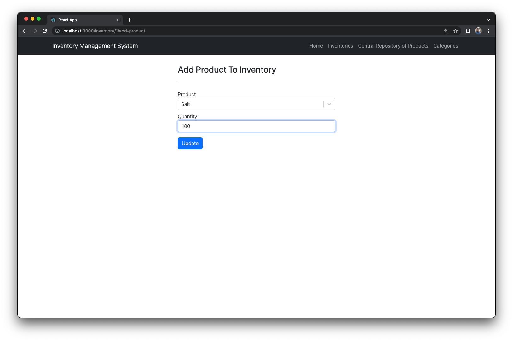

# Inventory-Management-System
## Final Project CS 6650

Team - Phwe Thant Chay(chay.p@northeastern.edu) & Pratik Sahu(Sahu.pr@northeastern.edu)
## Inventory Management System (IMS)

#### OVERVIEW

We have developed an Inventory Management System, that helps its users to create and manage
multiple inventories. User can access this application interacting with a web application. The
application coherently works with the help of distributed components like responsive web
application by React framework, three spring-boot services namely inventory-service, product-
service and category-service and a eureka discovery server that helps in inter-service
communication. All three micro-services have their own databases. React UI interacts only with
inventory-service that forwards the calls if required to product or category service. Inventory
service acts as an api gateway for us. It serves as the main service that keeps the UI transparent
from the presence of multiple micro-services in the backend. Eureka discovery server helps three
micro-services communicate using names rather than binding the inner services with a particular
port and requiring each of them to remember other’s ports to interact with them. Product or
category service can be deployed onto any different port as well yet they will function the same as
discovery-server takes care of remembering their port numbers and helps redirect the calls through
itself to correct port number.

Architecture of Inventory Management System Application:

This application supports below features:

- There is Central Repository of products that has details of all the products in certain quantities belonging to a particular category. On the homepage, user can see the list of products in this central repository, list of categories.
- User can create their own inventory. Once created, they can choose to add products into the inventory by selecting the product and specifying the quantity of products required in their inventory. When they submit, required quantity of products is added to the inventory while subtracted from the central repository since it has moved to the inventory now.
- User can create a new category
- User can create a new product and update their descriptions
- User can create, delete an inventory and add or remove products from/to it
- User can view all the products, categories and inventories on the homepage
- User can select appropriate tab to perform various operations on Inventories, Products or Categories

##### SAMPLE USE-CASE

Example:

- User can create a new category by clicking on ‘Create Category’ on the homepage, that takes user to a new page with an input form for the new category. User can then enter the name of the new category like ‘Electronics’ or ‘Kitchen’.
- Now user can add a new product for the same category onto the central repository of products by clicking on the ‘ Create Product’ on the homepage, that takes them to a new page with an input form for the new category. User can then enter the name of product as ‘Olive Oil’, Price as ’10’, Quantity as ‘1000’, select the category from the drop-down menu as ‘Kitchen’ and add description as ‘Cooking Oil’ then click ‘Create Product’. This creates a new product from the new category.
- Now since the new product is created this can be added to an inventory. So Let us create a new repository by clicking on ‘Create Inventory’ on the homepage, that takes the user to an input form to enter the name of the new inventory. User can enter something like ‘Target-Boylston’ to signify an inventory of products.
- To add a product onto this newly created inventory, User can click on ‘details’ on the home page where a list of inventories is displayed against the name of the inventory ‘Target-Boylston’. This takes user to a new page that shows details of all the products in the inventory.
- User can then click on ‘Add Product to Inventory’, then user can select the product to be added as ‘Olive Oil’ and specify the quantity as ‘100’(Note that this quantity must be less than what we added to the central repository) and click on ‘Update’. Note that the new product created will be present in this drop-down list of products.
- Now when user comes back to the details page of the inventory ‘Target-Boylston’, they will be able to see the product is added to the inventory. At the same time, user can also observe the quantity of products in the central repository of products showing the deducted quantity to be 900 now since that much has been now added to the inventory.

##### SETUP

- Unzip the IMS.zip file and go to ‘Executable’ folder inside it.
- We have 3 micro-services and one discovery-server to run, so open 4 terminals.
- Execute these 4 commands on each terminal in the given sequence only: 
java -jar discovery-server-1.0-SNAPSHOT.jar  
java -jar category-service-1.0-SNAPSHOT.jar 
java -jar product-service-1.0-SNAPSHOT.jar 
java -jar inventory-service-1.0-SNAPSHOT.jar 
Step 3		 
Step 4   

- Now the backend should be up and running and you will be able to see the logs on each of the terminals.

- Once all the service are running, it should look like above step 4 screenshot.

NOTE: These 4 backend services are required to be run in sequence as we have a discovery-server that acts like a Naming server for other 3 micro-services such that they can be configured to run on any port and they just need to register themselves with the discovery server informing them of their current ports. These three services work coherently to serve as backend of the application so internal communication happens through name of the services rather than the hard-coded ports. Discovery server helps redirect calls from one service to another by keeping the registered services transparent of the ports they are running on. In some cases, we can pin up multiple instances of these backend services as well and discovery server can help in load balancing among them. We do not have such a use case to support replicas of service yet.

- For the front-end, start docker on your system and execute this command on a terminal :          ‘docker run --rm --name inventory-container -p 3000:3000 phwethantchay/inventory-management-system-react’ . We have dockerised the front-end application and pushed onto docker hub, so if you have your docker running on the system and an active internet connection then this command will pull the image and run on your system.
- Now UI should start to run in few seconds, and same can be accesses on :’http://localhost:3000’
 

 

 

##### ALGORITHMS

IMS Application developed is a distributed system consisting of various components like a UI based on React, 3 Spring-boot micro-services working coherently and another Eureka discovery server yet keeping the experience to the end-user transparent of the presence of multiple distributed components. We have used some algorithms relevant to distributed systems in our application:

###### Fault Tolerance: 
A component of our application is used as an example for show-casing the fault tolerance behaviour of our application. To achieve it, we have incorporated Resilience4j library into our application that enables us with the feature of configuring multiple behaviours with respect to fault-tolerance, one of them being adding a fallback mechanism in-place if any of the component fails. If any component fails, calls to that failed component will show a fallback/default response and once the component heals and operational then system can again function fully. This makes sure to keep the application up and running even if a failure occurs and only for the period when failure occurs some part of the application is affected but application can still keep running and come back to its normal state when the failure is resolved.

###### Use-case: 
When user intends to just view the products in inventory, they can click on the Inventory tab and then view the products and their details on the web app. One of the details is the category-name that is the data present with category-service. Now, at this instant if category-service dies and user still wants to see the details of the products in the inventory then they will see a fallback response from the category service onto the data for the category name and it will show up as ‘Default Category’. Now, if the component stays failed then till that time user may not be able to perform any write operation that involves category details but can still see other product details. Once the category-service has healed and user refreshes the webpage then they will be able to see all the details including category-name and now the application is fully functional again.

Before category-service failed:

After category-service failed(Fallback behaviour):

Circuit-breaker working in Resilience4j:

###### Internal working: 
Resilience4j provides the fault-tolerance features with the help of a circuit-breaker pattern. This pattern works like an electrical MCB(Miniature Circuit Breaker) for micro-services interacting with REST API calls. Framework detects failure from the configured failure threshold(inventory-service > src > main > resources > application.yml), opens the circuit and invokes the fallback behaviour
(inventory-service > src > main > java > com.neu.inventoryservice.services.CategoryService : 31). When the category-service heals and configured time is elapsed calls to it succeed then circuit closes and state of the application is restored to a healthy one and all the features again start working. Since he application never crashes but handles the failure by narrowing down the features for a temporary time and restores its healthy state on itself when failure is resolved, we can say that it is a system that can tolerate faults.

##### Distributed Transaction: 
Our application works coherently with the help of three micro-services namely inventory-service, product-service and category-service. As their names suggest category-service stores data for categories, product-service stores details of the products and inventory service maintains a kind of a table of inventories and products in them. Inventory-service is our outermost service that is the first place where requests enter to backend that also acts as an api-gateway on our case. Product service can be seen as central repository of products and contains the list of products, its details and quantities available in the central repository.

###### Use case: 
User of the application can create an inventory and add products onto it specifying some quantity. This is the beginning of a distributed transaction. When user adds some quantity of product into the inventory, it is deducted from the central repository which is maintained by the product-service. To explain more precisely, some quantity of a product are withdrawn from product-service and then added onto an inventory whose data resides with inventory-service. For this manipulation of quantities to happen, more than one distributed component are involved that make it a distributed transaction. You can refer to ‘Salt’ product in below example:

###### Internal working: 
When a product is added to an inventory, first call is made to the product-service to check if enough quantity is available to be added to the inventory. If sufficient quantity is available in the central repository as responded by the product-service, then deducted quantity is updated on the product-service and this call is made by the inventory-service. Once it is successfully deducted, then inventory service makes an entry of the specified quantity of product onto the inventory entry in the inventory-service. This is how the distributed transaction is completed in our application.

##### Self-stabilisation: 
To showcase fault-tolerance feature of our application, we simulate the failure of category-service. The write operations happening at category-service are persisted onto a database file. When the category-service is killed, the database file still has all the record of the write operations happened in this service, so whenever the category-service is restarted, it starts and repopulates the data that was their before in the application so that it remains consistent with already running inventory-service and product-service. Since the category-service when restarted after failure can restore its state onto a correct state, we can call it a behaviour of self-stabilisation.

###### Use case: 
User creates an inventory using the web application. Now, they want to add a new product to the central repository that belongs to a new category altogether. So, to do this operation, user first needs to create a category using the web app. Let us say the created a category called ‘Electronics’. Now they come back to the homepage and try to add a product onto the central repository of products, they fill in the details of the product and select this new category that was created. Now, user can add some eligible quantity of this new product onto an inventory. They can do so by creating an inventory then going to the details page of the inventory and adding a product. Once the product is added they can see the details of this product onto the inventory details page. Now at this instant when the user tries to see this newly created product being added to an inventory, if category-service dies, then they will see category-name as ‘Default Category’. Now, when the category-service is restarted, if our application did not support self-stabilisation then category-service would not have data for this newly created category that was created before its failure. But since our application supports self-stabilisation, new or old categories, all the details will be shown when all the applications are and application will remain in a correct state.

In above example, we add a new category, add a product for that category onto our central repository of products, then add this to one of the inventories. Then category-service fails and restarts and still shows the newly created category that was created before its failure showing behaviour of self-stabilisation.

###### Internal working: 
Whenever a write operation happens at the category-service, it is written onto a persistent database file. So whenever the application restarts, data that was created in previous run will still be present in the database file which will be read by the category-service to bring the service to a consistent state. This way this service self-stabilises and remains in a correct state whenever alive.

### DESIGN DISCUSSION

IMS is implemented using micro-services architecture. 
Following are the components of the Application:
- API Gateway acts as the central component which is responsible to handle all the user requests. It coordinates with and delegates smaller tasks to other components like Product Service and Category Service to fetch the required data and provide it to the user.
- Product Service is responsible to handle all the data related to a product. To save the data for the products, it uses a relational SQL database H2.
- Category Service is responsible to handle all the data related to a category. This service also uses a relation SQL database H2.
- Eureka Discovery service acts as DNS server that remembers all the addresses of multiple micro-services and lets them interact using service name rather than an actual physical address. This frees up micro-services from being tied up to a fixed port number in order to interact with other micro-service. It also enables to load balance among multiple replica instances of a micro-service if required.

For the design, we have divided frontend and backend as separate applications for better scalability and to prevent single point of failure for frontend if any of the backend services are down and the same goes for the backend.

For frontend, the project uses react framework for managing design and reusable UI components of the inventory website and Bootstrap 5 UI framework has been integrated into React website for the design of UI components and website structure.  The inventory react frontend website is separated from the backend micro-services and connected to the backend application via REST APIs services.

For the backend, we have used Spring boot for building micro-services which work as independent components that run each application process as a service.  These services communicate via a well-defined interface using lightweight APIs.  Each service performs a single function because they are independently run, each service can be updated, deployed and scaled to meet demand for specific functions of an application.  For the inventory management system, we have created three micro-services which are inventory, product and category.  Each micro-service will have their own database to store data and utilise Spring-data-jpa to create the schema, which will be based on the open source, lightweight, H2 SQL database system.  If any of the micro-service fails and the number of consecutive failures crosses a defined threshold, the circuit breaker in Spring boot turns off and for the duration of a timeout period all attempts to call the remote service will fail immediately.  To provide a resilient, fault-tolerant mechanism for Spring boot, we have used Resilience 4j which is an alternative lightweight fault-tolerant library inspired from Netflix Hystrix and designed for Java 8 and functional programming.  In case of any of the micro-service component failure, we have configured Resilience 4j to respond with default responses, for example, if category service is down, circuit breaker will cut off all the attempts to call to fail service and respond with default set of values so it won’t affect other services and frontend website will keep working in case of service failure.  In order to discover different services under the same project, we have used Eureka which is a client-side service discovery that allows services to find and communicate with each other without hardcoding the hostname and port.  The only fixed point in such an architecture is the service registry, with which each service to register.  With Eureka, each client can simultaneously act as a server to replicate its status to a connected peer.  In other words, a client retrieves a list of all connected peers in a service registry and makes all further requests to other services through a load-balancing algorithm.  To be informed about the presence of a client, they have to send a heartbeat signal to the registry.  All instances of micro-services, register themselves with the Eureka which is also called as a naming server and asks the naming server about the available instances if a micro-service wants to talk to another micro-services.

### REFERENCES

https://resilience4j.readme.io/docs/comparison-to-netflix-hystrix